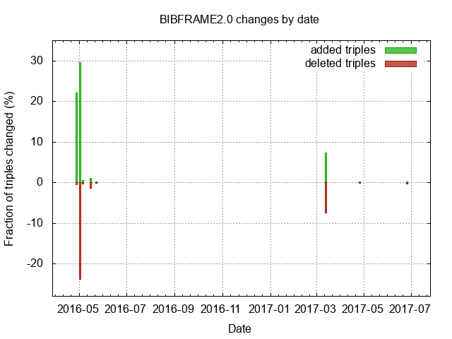

# BIBFRAME 2 Spec version control and change monitoring

Note: From 2016-05-20 through 2017-03-10 there was no harvesting of the ontology. Thus all of the updates during that period are rolled into the 2017-03-14 commit (about 150 triples changed).
